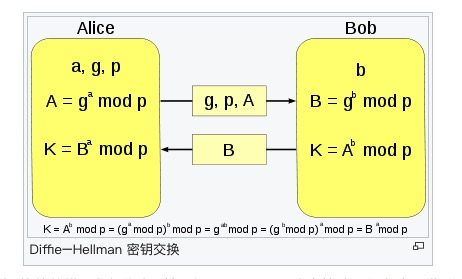

 

#####  说明

DiffieHellmanKeyExchange 迪菲-赫尔曼密钥交换

意外看到了这个算法，勾起对非对称加密中密码交换的问题的思考：如何安全的传输密钥？

这个算法专利在1997年过期，可以使用。

##### 过程说明

ALICE和BOB要进行秘密的交流，使用RSA算法来加密。但是需要将密钥发送给对方。

于是两人使用了迪菲-赫尔曼密钥交换算法。

1. ALICE和BOB事先协定私钥P和G。

2. ALICE生成自己的秘密整数a，BOB生成自己的秘密整数b。这个数字是保密的，只能自己知道。

3. ALICE计算A = powmodp(G, a)，并将A发送给BOB；
BOB计算B = powmodp(G, b)，并将B发送给ALICE；

4.  ALICE计算secret1= powmodp(B,a); secret1就是密钥；BOB计算secret2 = powmodp(A,b); secret2就是密钥。
secret1是等于secret2的，两个人的密钥就交换完毕了。

##### 通病

无法防御中间人攻击

##### 附加链接

https://zh.wikipedia.org/wiki/%E8%BF%AA%E8%8F%B2-%E8%B5%AB%E7%88%BE%E6%9B%BC%E5%AF%86%E9%91%B0%E4%BA%A4%E6%8F%9B

https://www.geeksforgeeks.org/implementation-diffie-hellman-algorithm/

